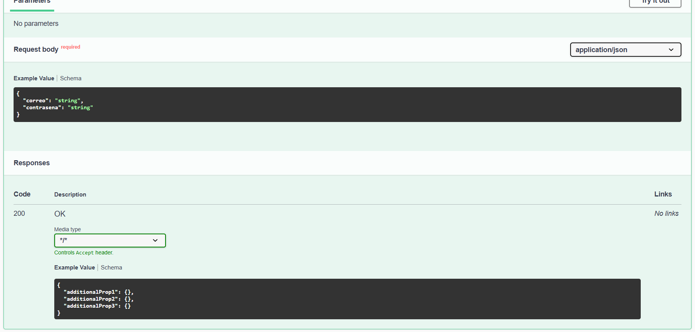
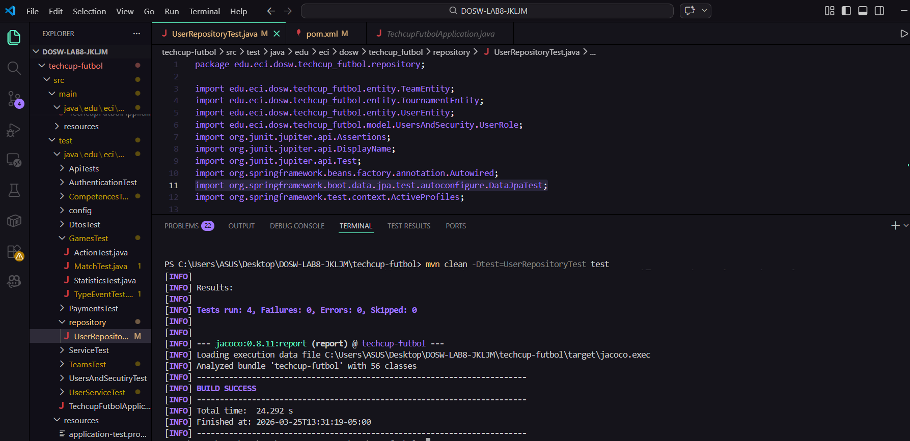

# DOSW-LAB9-JKLJM
---
# ENTITY SELECTION (STEP 3)


http://localhost:8080/api/users

¿El servidor está corriendo?

Ejemplo según tecnología:

Java (Spring Boot): mvn spring-boot:run

swagger

http://localhost:8080/swagger-ui.html
http://localhost:8080/swagger-ui/index.html


Seleccionamos 3 entidades que cumplan con Autenticacion, Usuarios y Torneo:  

* User  

* Tournament  

* Team   

**UserEntity**  es crítica para autenticación y autorización, almacenando credenciales y permisos de usuario. **TournamentEntity** define el evento central del negocio con configuración global, fechas, límites y costos. **TeamEntity** actúa como nexo relacional: vincula usuarios (organizadores) con torneos específicos, registrando participaciones, pagos y permitiendo que múltiples equipos de diferentes usuarios compitan en un mismo torneo. Juntas forman la estructura completa: usuarios que crean y organizan torneos, mediante equipos que participan en ellos (relación 1:N entre usuario-equipo y N:1 entre equipo-torneo). Sin estas tres, no hay identidad, evento ni participación.

---


# Swagger api tournament


## Swagger - API de autenticacion

Captura 1:


Captura 2:



---

# Evidencia UserRepositoryTest

Captura de la ejecucion de pruebas de repositorio:



## Pruebas realizadas

Se ejecutaron las siguientes pruebas en `UserRepositoryTest`:

1. Prueba de guardado: `shouldSaveUser`.
2. Prueba de consulta: `shouldFindByEmail`.
3. Prueba de relacion entre entidades: `shouldSaveUserWithTeam`.
4. Prueba de actualizacion: `shouldUpdateUser`.

## Como se ejecutaron

1. Se corrigio la configuracion de pruebas para Spring Boot 4 (anotacion `DataJpaTest` y dependencia de pruebas JPA en `pom.xml`).
2. Se ejecuto el test de repositorio con Maven:

```bash
mvn clean -Dtest=UserRepositoryTest test
```

3. Se verifico en consola el resultado:

- `BUILD SUCCESS`
- `Tests run: 4, Failures: 0, Errors: 0, Skipped: 0`

Dependencia agregada para pruebas JPA en Spring Boot 4:

```xml
<dependency>
	<groupId>org.springframework.boot</groupId>
	<artifactId>spring-boot-data-jpa-test</artifactId>
	<scope>test</scope>
</dependency>
```
