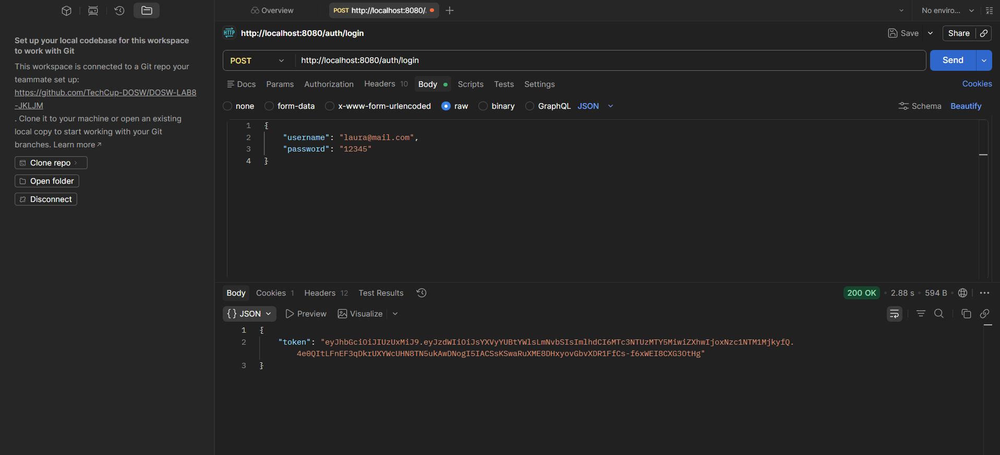

# DOSW-LAB9-JKLJM
---
# ENTITY SELECTION (STEP 3)


http://localhost:8080/api/users

¿El servidor está corriendo?

Ejemplo según tecnología:

Java (Spring Boot): mvn spring-boot:run

swagger

http://localhost:8080/swagger-ui.html
http://localhost:8080/swagger-ui/index.html


Seleccionamos 3 entidades que cumplan con Autenticacion, Usuarios y Torneo:  

* User  

* Tournament  

* Team   

**UserEntity**  es crítica para autenticación y autorización, almacenando credenciales y permisos de usuario. **TournamentEntity** define el evento central del negocio con configuración global, fechas, límites y costos. **TeamEntity** actúa como nexo relacional: vincula usuarios (organizadores) con torneos específicos, registrando participaciones, pagos y permitiendo que múltiples equipos de diferentes usuarios compitan en un mismo torneo. Juntas forman la estructura completa: usuarios que crean y organizan torneos, mediante equipos que participan en ellos (relación 1:N entre usuario-equipo y N:1 entre equipo-torneo). Sin estas tres, no hay identidad, evento ni participación.

---

- Second test now with the username and password that gives us security. It should be noted that we forgot to add the user before running, therefore they don't appear but it does accept it.
  


--- 

- Final test where it is with those assigned by us
  


---

- Evidencia solicitada: login exitoso en Postman con token JWT



```xml
<dependency>
	<groupId>org.springframework.boot</groupId>
	<artifactId>spring-boot-data-jpa-test</artifactId>
	<scope>test</scope>
</dependency>
```


despliegue 


